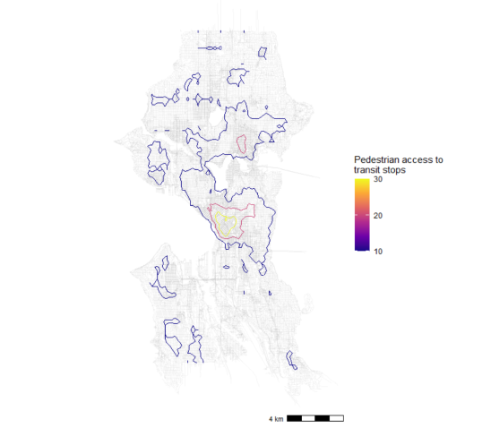

```{r setup, include=FALSE}
knitr::opts_chunk$set(echo = TRUE)
```

# Introduction

This portfolio is a selection of work I produced for the Spatial Analysis module in Fall 2021. 

The learning objectives for this course included displaying spatial data and relationships, visualizing places, mapping routes and networks, and creating interactive, web-based maps.

In addition to learning technical spatial analysis skills, the course discussed data sourcing and representation ethics. 


# Cambridge, MA


The maps below explore the locations of public libraries in Cambridge, MA. The first map shows the relationship of community gardens to public libraries and the second shows the number of libraries per neighborhood. 

Skills demonstrated: 

  - Displaying multiple vector layers on the same map
  
  - Calculating and displaying relationships among point and polygon layers based on distance

**Map 1: Proximity of Community Gardens to Public Libraries in Cambridge, MA**
[](https://kmyros.github.io/Portfolio_2021/fullsize/cambridge_map1.png){target="_blank"}

*Source: Cambridge Open Data.* 


Skills demonstrated: 

  - Aggregating point data to a layer of polygons


**Map 2: Number of Libraries per Neighborhood in Cambridge, MA** 
[](https://kmyros.github.io/Portfolio_2021/fullsize/cambridge_map2.png){target="_blank"}

*Source: Cambridge Open Data.* 


# Middlesex County, MA 

Below is an interactive map showing the 2015-2019 American Community Survey estimates of the foreign-born population in Middlesex County in Massachusetts. The foreign-born population includes naturalized citizens and immigrants. Click on the map to see where in the county there are clusters of foreign-born communities. 

Skills demonstrated: 

  -  Displaying data on an interactive map
  
**Map 3: Foreign-Born Population in Middlesex County by Census Tract, 2019**

[](https://kmyros.github.io/Portfolio_2021/fullsize/Assignment-6.html){target="_blank"}

*Source: U.S. Census Bureau, ACS 5-year estimates, 2015-2019.* 


# Philadelphia, PA


The map of Philadelphia is a map from the late 1700s georeferenced to modern Philadelphia's urban landscape. 

Skills demonstrated: 

  - Georeferencing a raster image
  
**Map 4: Historic Philadelphia with Modern Features**

[](https://kmyros.github.io/Portfolio_2021/fullsize/philadelphia_map.pdf){target="_blank"}

*Source: Harvard University Pusey Library Map Archive, Open Data Philadelphia.* 


# Seattle, WA


The following maps show a network analysis of the Seattle transit system and how many transit stops can be accessed by a pedestrian within 10 minutes. 


Skills demonstrated: 

  - Calculating and displaying accessibility, based on travel time

  - Displaying raster data on a map

  


**Map 5: Pedestrian Access to Transit Stops in Seattle, WA** 

[](https://kmyros.github.io/Portfolio_2021/fullsize/seattle_map1.png){target="_blank"}

*Source: OpenStreetMap data.* 


Skills demonstrated:

  - Converting between raster layers and vector layers


**Map 6: Pedestrian Access to Transit Stops in Seattle, WA** 

[](https://kmyros.github.io/Portfolio_2021/fullsize/seattle_map2.png){target="_blank"}

*Source: OpenStreetMap data.*

